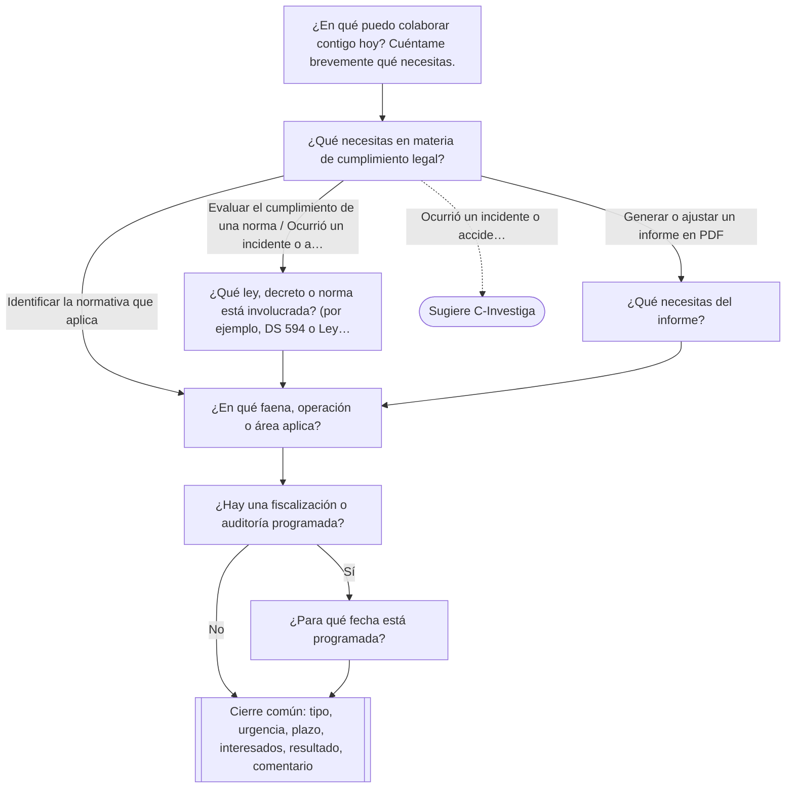
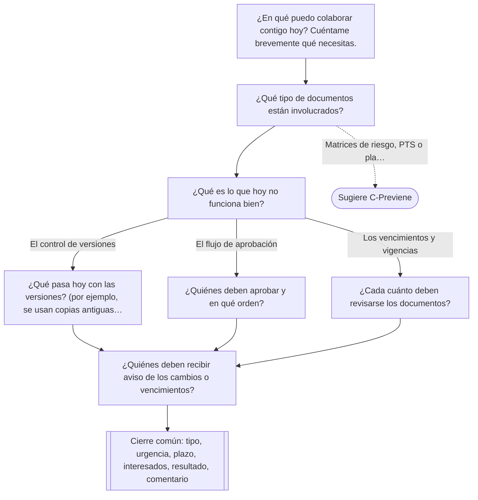
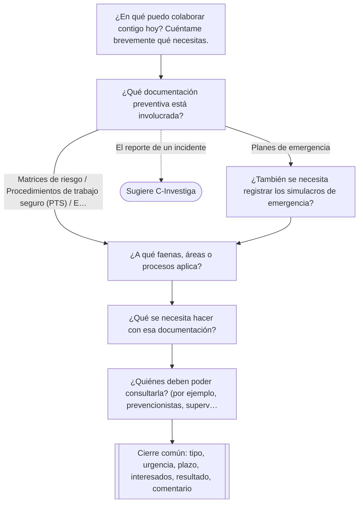
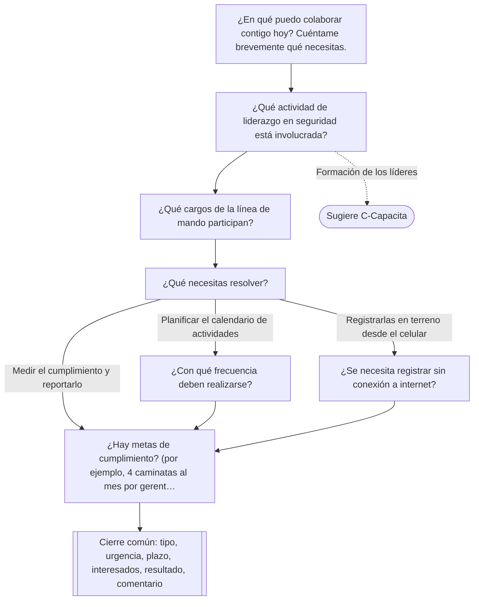
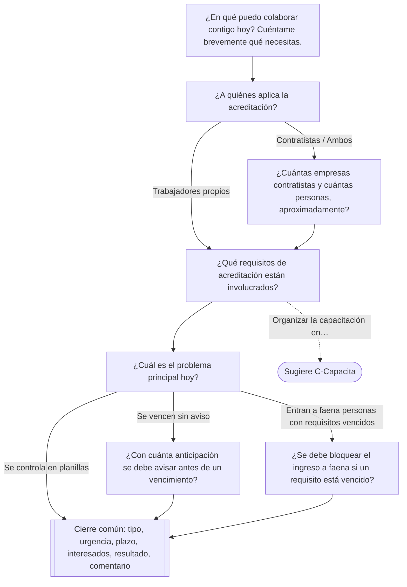
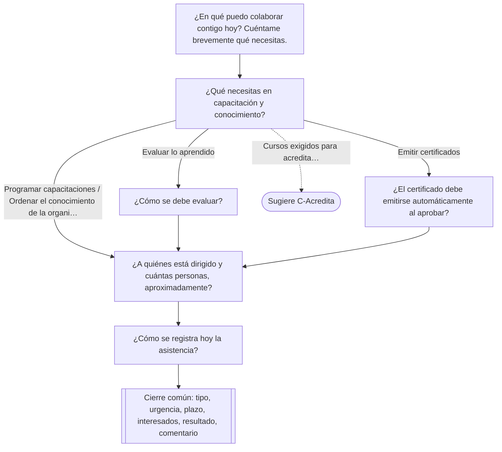
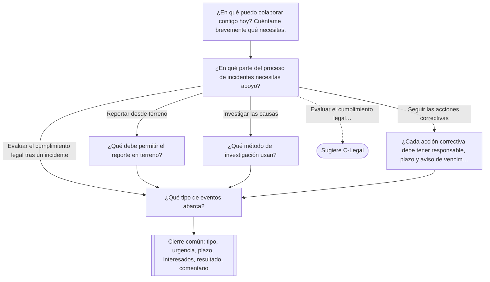

# Árboles de decisión de las salas — BORRADOR para revisión

> Generado desde `lib/chat/arboles.ts` con `npm run arboles:doc`; no editar a mano. Issue #17.

Cada sala entrevista con preguntas definidas de antemano, sin IA: las respuestas eligen la rama siguiente.
Para revisar, comenta directamente en las líneas de este archivo en el pull request (redacción de una
pregunta, opciones que faltan o sobran, ramas, qué es obligatorio y qué no).

**Estructura de cada entrevista**

1. **Inicio** (todas las salas): «¿En qué puedo colaborar contigo hoy? Cuéntame brevemente qué necesitas.»
   (texto, obligatorio, mínimo 25 caracteres).
2. **Rama del módulo**: preguntas propias de la sala; algunas respuestas llevan a otra rama o sugieren otra sala.
3. **Cierre común** (todas las salas): tipo de solicitud, urgencia, plazo, interesados, resultado esperado y comentario.

Botones durante la entrevista: «Pasar a la siguiente pregunta» salta solo preguntas **no obligatorias**;
«Agregar más detalles» amplía la respuesta actual. Al terminar el cierre común se habilita «Finalizar y generar
requerimiento». Ningún recorrido supera 12 preguntas.

**Prioridad del requerimiento**: la de la pregunta de urgencia del cierre común; algunas respuestas de la rama
fijan una prioridad **mínima** (por ejemplo, una fiscalización programada → al menos alta). Se usa la más alta.

| Sala | Preguntas | Recorrido | Ramas | Sugiere otra sala |
|---|---|---|---|---|
| [C-Legal](#c-legal) | 7 propias (con la de inicio) + 6 comunes | de 10 a 12 | 2 | C-Investiga |
| [C-Controla](#c-controla) | 7 propias (con la de inicio) + 6 comunes | 11 | 1 | C-Previene |
| [C-Previene](#c-previene) | 6 propias (con la de inicio) + 6 comunes | de 11 a 12 | 1 | C-Investiga |
| [C-Lidera](#c-lidera) | 7 propias (con la de inicio) + 6 comunes | de 11 a 12 | 1 | C-Capacita |
| [C-Acredita](#c-acredita) | 7 propias (con la de inicio) + 6 comunes | de 10 a 12 | 2 | C-Capacita |
| [C-Capacita](#c-capacita) | 6 propias (con la de inicio) + 6 comunes | de 10 a 11 | 1 | C-Acredita |
| [C-Investiga](#c-investiga) | 6 propias (con la de inicio) + 6 comunes | de 9 a 10 | 1 | C-Legal |

## C-Legal

**Cumplimiento Legal.** Identifica la normativa aplicable a la operación, evalúa su cumplimiento artículo por artículo y genera informes en PDF.

Recorrido: de 10 a 12 preguntas.

| Pregunta | Tipo | Obligatoria | Respuestas → siguiente |
|---|---|---|---|
| `inicio` ¿En qué puedo colaborar contigo hoy? Cuéntame brevemente qué necesitas. | Texto libre | Sí | → `legal.ambito` mínimo 25 caracteres; si no, repregunta una vez |
| `legal.ambito` ¿Qué necesitas en materia de cumplimiento legal? | Opciones (una) | Sí | «Identificar la normativa que aplica» → `legal.operacion` «Evaluar el cumplimiento de una norma» → `legal.norma` «Generar o ajustar un informe en PDF» → `legal.informe` «Ocurrió un incidente o accidente» → `legal.norma`, **sugiere C-Investiga** |
| `legal.norma` ¿Qué ley, decreto o norma está involucrada? (por ejemplo, DS 594 o Ley 16.744) | Texto libre | Sí | → `legal.operacion` mínimo 3 caracteres; si no, repregunta una vez |
| `legal.informe` ¿Qué necesitas del informe? | Opciones (una) | Sí | «Un informe nuevo» → `legal.operacion` «Cambiar el formato o contenido de uno existente» → `legal.operacion` «Recibirlo en forma periódica» → `legal.operacion` |
| `legal.operacion` ¿En qué faena, operación o área aplica? | Texto libre | Sí | → `legal.fiscalizacion` mínimo 3 caracteres; si no, repregunta una vez |
| `legal.fiscalizacion` ¿Hay una fiscalización o auditoría programada? | Sí / No | Sí | «Sí» → `legal.fiscalizacion_fecha`, prioridad mínima **alta** «No» → cierre común |
| `legal.fiscalizacion_fecha` ¿Para qué fecha está programada? | Fecha | Sí | → cierre común |

## C-Controla

**Control Documental.** Controla versiones, aprobaciones y vigencias de procedimientos, registros y documentos críticos.

Recorrido: 11 preguntas.

| Pregunta | Tipo | Obligatoria | Respuestas → siguiente |
|---|---|---|---|
| `inicio` ¿En qué puedo colaborar contigo hoy? Cuéntame brevemente qué necesitas. | Texto libre | Sí | → `controla.documento` mínimo 25 caracteres; si no, repregunta una vez |
| `controla.documento` ¿Qué tipo de documentos están involucrados? | Opciones (varias) | Sí | «Procedimientos» «Registros» «Instructivos o formularios» «Matrices de riesgo, PTS o planes de emergencia» **sugiere C-Previene** «Otra» (respuesta escrita) luego → `controla.problema` |
| `controla.problema` ¿Qué es lo que hoy no funciona bien? | Opciones (una) | Sí | «El control de versiones» → `controla.versiones` «El flujo de aprobación» → `controla.aprobadores` «Los vencimientos y vigencias» → `controla.vigencia` |
| `controla.versiones` ¿Qué pasa hoy con las versiones? (por ejemplo, se usan copias antiguas o no se sabe cuál es la vigente) | Texto libre | Sí | → `controla.notificar` mínimo 15 caracteres; si no, repregunta una vez |
| `controla.aprobadores` ¿Quiénes deben aprobar y en qué orden? | Texto libre | Sí | → `controla.notificar` mínimo 10 caracteres; si no, repregunta una vez |
| `controla.vigencia` ¿Cada cuánto deben revisarse los documentos? | Opciones (una) | Sí | «Una vez al año» → `controla.notificar` «Cada seis meses» → `controla.notificar` «Depende de cada documento» → `controla.notificar` «Otra» (respuesta escrita) luego → `controla.notificar` |
| `controla.notificar` ¿Quiénes deben recibir aviso de los cambios o vencimientos? | Texto libre | No (se puede saltar) | → cierre común |

## C-Previene

**Gestor Documental.** Centraliza la documentación preventiva: matrices de riesgo, procedimientos de trabajo seguro (PTS) y planes de emergencia.

Recorrido: de 11 a 12 preguntas.

| Pregunta | Tipo | Obligatoria | Respuestas → siguiente |
|---|---|---|---|
| `inicio` ¿En qué puedo colaborar contigo hoy? Cuéntame brevemente qué necesitas. | Texto libre | Sí | → `previene.documento` mínimo 25 caracteres; si no, repregunta una vez |
| `previene.documento` ¿Qué documentación preventiva está involucrada? | Opciones (una) | Sí | «Matrices de riesgo» → `previene.faena` «Procedimientos de trabajo seguro (PTS)» → `previene.faena` «Planes de emergencia» → `previene.simulacro` «El reporte de un incidente» → `previene.faena`, **sugiere C-Investiga** «Otra» (respuesta escrita) luego → `previene.faena` |
| `previene.simulacro` ¿También se necesita registrar los simulacros de emergencia? | Sí / No | Sí | «Sí» → `previene.faena` «No» → `previene.faena` |
| `previene.faena` ¿A qué faenas, áreas o procesos aplica? | Texto libre | Sí | → `previene.accion` mínimo 3 caracteres; si no, repregunta una vez |
| `previene.accion` ¿Qué se necesita hacer con esa documentación? | Opciones (varias) | Sí | «Centralizar lo que hoy está disperso» «Crear o actualizar contenido» «Controlar que los trabajadores la lean» luego → `previene.acceso` |
| `previene.acceso` ¿Quiénes deben poder consultarla? (por ejemplo, prevencionistas, supervisores, trabajadores) | Texto libre | No (se puede saltar) | → cierre común |

## C-Lidera

**Programas de Liderazgo.** Planifica y da seguimiento a programas de liderazgo en seguridad: caminatas, observaciones y compromisos de la línea de mando.

Recorrido: de 11 a 12 preguntas.

| Pregunta | Tipo | Obligatoria | Respuestas → siguiente |
|---|---|---|---|
| `inicio` ¿En qué puedo colaborar contigo hoy? Cuéntame brevemente qué necesitas. | Texto libre | Sí | → `lidera.actividad` mínimo 25 caracteres; si no, repregunta una vez |
| `lidera.actividad` ¿Qué actividad de liderazgo en seguridad está involucrada? | Opciones (varias) | Sí | «Caminatas de seguridad» «Observaciones de conducta» «Compromisos de la línea de mando» «Formación de los líderes» **sugiere C-Capacita** «Otra» (respuesta escrita) luego → `lidera.participantes` |
| `lidera.participantes` ¿Qué cargos de la línea de mando participan? | Texto libre | Sí | → `lidera.necesidad` mínimo 5 caracteres; si no, repregunta una vez |
| `lidera.necesidad` ¿Qué necesitas resolver? | Opciones (una) | Sí | «Planificar el calendario de actividades» → `lidera.frecuencia` «Registrarlas en terreno desde el celular» → `lidera.sin_conexion` «Medir el cumplimiento y reportarlo» → `lidera.metas` |
| `lidera.frecuencia` ¿Con qué frecuencia deben realizarse? | Opciones (una) | Sí | «Semanal» → `lidera.metas` «Mensual» → `lidera.metas` «Trimestral» → `lidera.metas` «Otra» (respuesta escrita) luego → `lidera.metas` |
| `lidera.sin_conexion` ¿Se necesita registrar sin conexión a internet? | Sí / No | Sí | «Sí» → `lidera.metas` «No» → `lidera.metas` |
| `lidera.metas` ¿Hay metas de cumplimiento? (por ejemplo, 4 caminatas al mes por gerente) | Texto libre | No (se puede saltar) | → cierre común |

## C-Acredita

**Gestión del personal.** Gestiona la acreditación de trabajadores y contratistas: documentos, exámenes, cursos y vencimientos en un solo lugar.

Recorrido: de 10 a 12 preguntas.

| Pregunta | Tipo | Obligatoria | Respuestas → siguiente |
|---|---|---|---|
| `inicio` ¿En qué puedo colaborar contigo hoy? Cuéntame brevemente qué necesitas. | Texto libre | Sí | → `acredita.quienes` mínimo 25 caracteres; si no, repregunta una vez |
| `acredita.quienes` ¿A quiénes aplica la acreditación? | Opciones (una) | Sí | «Trabajadores propios» → `acredita.requisito` «Contratistas» → `acredita.empresas` «Ambos» → `acredita.empresas` |
| `acredita.empresas` ¿Cuántas empresas contratistas y cuántas personas, aproximadamente? | Texto libre | No (se puede saltar) | → `acredita.requisito` |
| `acredita.requisito` ¿Qué requisitos de acreditación están involucrados? | Opciones (varias) | Sí | «Documentos (contrato, seguros, etc.)» «Exámenes ocupacionales» «Cursos obligatorios» «Organizar la capacitación en sí» **sugiere C-Capacita** «Otra» (respuesta escrita) luego → `acredita.problema` |
| `acredita.problema` ¿Cuál es el problema principal hoy? | Opciones (una) | Sí | «Se vencen sin aviso» → `acredita.anticipacion` «Se controla en planillas» → cierre común «Entran a faena personas con requisitos vencidos» → `acredita.bloqueo`, prioridad mínima **alta** |
| `acredita.anticipacion` ¿Con cuánta anticipación se debe avisar antes de un vencimiento? | Opciones (una) | Sí | «7 días» → cierre común «15 días» → cierre común «30 días» → cierre común «Otra» (respuesta escrita) luego → cierre común |
| `acredita.bloqueo` ¿Se debe bloquear el ingreso a faena si un requisito está vencido? | Sí / No | Sí | «Sí» → cierre común «No, solo avisar» → cierre común |

## C-Capacita

**Gestor del conocimiento.** Organiza capacitaciones, evaluaciones y el conocimiento de la organización, con registro de asistencia y certificados.

Recorrido: de 10 a 11 preguntas.

| Pregunta | Tipo | Obligatoria | Respuestas → siguiente |
|---|---|---|---|
| `inicio` ¿En qué puedo colaborar contigo hoy? Cuéntame brevemente qué necesitas. | Texto libre | Sí | → `capacita.necesidad` mínimo 25 caracteres; si no, repregunta una vez |
| `capacita.necesidad` ¿Qué necesitas en capacitación y conocimiento? | Opciones (una) | Sí | «Programar capacitaciones» → `capacita.publico` «Evaluar lo aprendido» → `capacita.evaluacion` «Emitir certificados» → `capacita.certificado` «Ordenar el conocimiento de la organización» → `capacita.publico` «Cursos exigidos para acreditar contratistas» → `capacita.publico`, **sugiere C-Acredita** |
| `capacita.evaluacion` ¿Cómo se debe evaluar? | Opciones (una) | Sí | «Una prueba al final» → `capacita.publico` «Con nota mínima para aprobar» → `capacita.publico` «Evaluación práctica en terreno» → `capacita.publico` «Otra» (respuesta escrita) luego → `capacita.publico` |
| `capacita.certificado` ¿El certificado debe emitirse automáticamente al aprobar? | Sí / No | Sí | «Sí» → `capacita.publico` «No, lo aprueba alguien antes» → `capacita.publico` |
| `capacita.publico` ¿A quiénes está dirigido y cuántas personas, aproximadamente? | Texto libre | Sí | → `capacita.asistencia` mínimo 5 caracteres; si no, repregunta una vez |
| `capacita.asistencia` ¿Cómo se registra hoy la asistencia? | Opciones (una) | No (se puede saltar) | «Firma en papel» → cierre común «Registro digital» → cierre común «No se registra» → cierre común |

## C-Investiga

**Reportabilidad e Incidentes.** Reporta incidentes desde terreno, investiga sus causas y realiza seguimiento a las acciones correctivas.

Recorrido: de 9 a 10 preguntas.

| Pregunta | Tipo | Obligatoria | Respuestas → siguiente |
|---|---|---|---|
| `inicio` ¿En qué puedo colaborar contigo hoy? Cuéntame brevemente qué necesitas. | Texto libre | Sí | → `investiga.necesidad` mínimo 25 caracteres; si no, repregunta una vez |
| `investiga.necesidad` ¿En qué parte del proceso de incidentes necesitas apoyo? | Opciones (una) | Sí | «Reportar desde terreno» → `investiga.terreno` «Investigar las causas» → `investiga.metodo` «Seguir las acciones correctivas» → `investiga.acciones` «Evaluar el cumplimiento legal tras un incidente» → `investiga.tipo`, **sugiere C-Legal** |
| `investiga.terreno` ¿Qué debe permitir el reporte en terreno? | Opciones (varias) | Sí | «Adjuntar fotos» «Funcionar sin conexión» «Registrar la ubicación» «Otra» (respuesta escrita) luego → `investiga.tipo` |
| `investiga.metodo` ¿Qué método de investigación usan? | Opciones (una) | Sí | «Árbol de causas» → `investiga.tipo` «5 porqués» → `investiga.tipo` «ICAM» → `investiga.tipo` «Otra» (respuesta escrita) luego → `investiga.tipo` |
| `investiga.acciones` ¿Cada acción correctiva debe tener responsable, plazo y aviso de vencimiento? | Sí / No | Sí | «Sí» → `investiga.tipo` «No» → `investiga.tipo` |
| `investiga.tipo` ¿Qué tipo de eventos abarca? | Opciones (varias) | Sí | «Accidentes con lesión» prioridad mínima **alta** «Incidentes sin lesión» «Cuasi accidentes» luego → cierre común |

## Cierre común (todas las salas)

| Pregunta | Tipo | Obligatoria | Respuestas → siguiente |
|---|---|---|---|
| `comun.tipo` ¿Qué tipo de solicitud es? | Opciones (una) | Sí | «Algo nuevo que hoy no existe» → cierre común, tipo **nueva funcionalidad** «Mejorar algo que ya existe» → cierre común, tipo **mejora** «Algo no funciona como debería» → cierre común, tipo **error** «Es una consulta» → cierre común, tipo **consulta** |
| `comun.urgencia` ¿Qué tan urgente es? | Opciones (una) | Sí | «Hay riesgo para las personas» → cierre común, prioridad mínima **crítica** «Hay una fiscalización o un plazo legal próximo» → cierre común, prioridad mínima **alta** «Afecta el trabajo diario» → cierre común, prioridad mínima **media** «Es una mejora deseable, sin apuro» → cierre común, prioridad mínima **baja** |
| `comun.plazo` ¿Hay una fecha límite? Si no la hay, puedes pasar a la siguiente pregunta. | Fecha | No (se puede saltar) | → cierre común |
| `comun.interesados` ¿Quiénes usarán el resultado o deben estar al tanto? (cargos, áreas o personas) | Texto libre | No (se puede saltar) | → cierre común |
| `comun.resultado` ¿Cómo sabremos que quedó bien? Describe el resultado que esperas. | Texto libre | Sí | → cierre común mínimo 20 caracteres; si no, repregunta una vez |
| `comun.cierre` ¿Algo más que quieras agregar antes de generar el requerimiento? | Texto libre | No (se puede saltar) | → fin |
